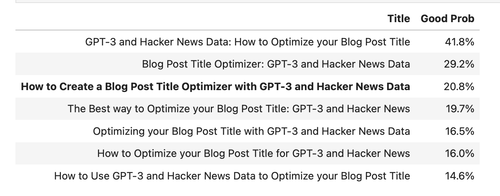

# GPT-3 Blog Title Optimizer

Python code for building a GPT-3 based technical blog post optimizer, given that the user provides their own OpenAI keys and resources.

The [walkthrough Notebook](gpt3_title_optimizer_walkthrough.ipynb) gives a technical explanation on how to interface with the GPT-3 API, with the [demo Notebook](gpt3_title_optimizer_demo.ipynb) providing more concrete examples of the optimizer in action.

The Notebooks provided here are a tutorial and demo on how to use GPT-3 in this manner: to use them for yourself, you will need to finetune your own GPT-3 model as noted in the corresponding blog post [How to Create a Blog Post Title Optimizer with GPT-3 and Hacker News Data](https://minimaxir.com/2022/08/gpt3-blog-title-optimizer/).

# App Review Compliance

This repo is released under the [Open-source / Bring-Your-Own-Key applications](https://beta.openai.com/docs/usage-guidelines/open-source-bring-your-own-key-applications) provision of OpenAI's usage guidelines as the constraints make the results neither high-stakes nor disallowed.

Since the Notebook is intended to be used on an _ad hoc_, non-recurring basis, it does not fall into the [provision of requiring to submit an app review](https://beta.openai.com/docs/usage-guidelines/who-is-required-to-submit-an-app-review). (if OpenAI disagrees, feel free to contact me)

## Maintainer/Creator

Max Woolf ([@minimaxir](https://minimaxir.com))

_Max's open-source projects are supported by his [Patreon](https://www.patreon.com/minimaxir) and [GitHub Sponsors](https://github.com/sponsors/minimaxir). If you found this project helpful, any monetary contributions to the Patreon are appreciated and will be put to good creative use._

## License

MIT
